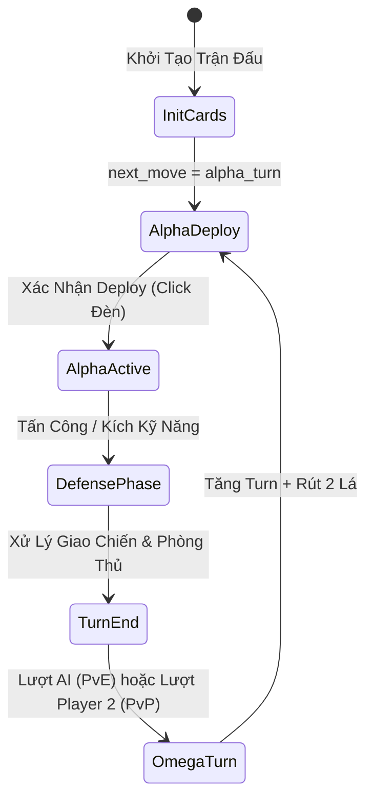

# 01. Luật Chơi & Cơ Chế Trận Đấu

## 1. Tổng Quan & Điều Kiện Thắng Thua

**_sg03** là trò chơi thẻ bài chiến thuật theo lượt diễn ra giữa hai phe đối đầu:
- **Phe Alpha**: Người chơi 1 (Human Player).
- **Phe Omega**: Người chơi 2 hoặc Địch thủ AI (Boss Goblin Shaman).

### Điều Kiện Thắng / Thua
- **Chiến Thắng**: Đưa lượng HP đối phương (`omega_hp`) về `0`.
- **Thất Bại**: Lượng HP của bạn (`alpha_hp`) chạm mức `0`.

---

## 2. Cấu Trúc Bàn Đấu & Các Khu Vực Bài

Bàn đấu gồm **5 khu vực chứa bài riêng biệt** cho mỗi bên (cả Alpha và Omega):

| Tên Khu Vực | Sức Chứa | Mô Tả Chi Tiết |
|---|---|---|
| **Bí Cảnh Cung (`the_source`)** | Thay đổi | Nơi tích tụ thần khí chứa các lá bài 1 đến 3 sao chưa được rút lên tay. |
| **Tay Bài (`hand`)** | Tối đa 5 slot | Tay cầm bài chứa các lá sẵn sàng thả ra sân. |
| **Tiền Tuyến (`front_line`)** | 5 slot cố định (0-4) | Hàng tiền tuyến. Các đơn vị đặt ở đây thực hiện tấn công, chặn đòn đánh của địch và kích hoạt kỹ năng tiền tuyến. |
| **Hậu Thuẫn (`back_line`)** | 5 slot cố định (0-4) | Hàng hậu thuẫn. Chứa các đơn vị hỗ trợ hoặc công trình/pháp bảo kỹ năng mang lại hiệu ứng buff. |
| **Mộ Bài (`the_void`)** | Không giới hạn | **Nơi chứa bài bị tiêu diệt, bài đã dùng và Thẻ Cao Cấp**:  • Chứa các bài Nhân vật tử trận và bài Kỹ năng đã thi triển. • **Mặc Định Đầu Game**: Tất cả thẻ Nhân vật từ **4 sao trở lên (4-9 sao)** đều nằm sẵn tại **Mộ Bài (`the_void`)** lúc `init_cards`, không thể rút lên `hand`. Người chơi cần dùng bài Chiêu Hồi để hồi sinh các lá này từ `the_void` ra mặt trận. |

---

## 3. Vòng Đời Trận Đấu & Luồng Lượt Chơi

### 3.1. Phase Machine (Hệ Thống Chuyển Giai Đoạn)

Trận đấu tiến triển qua các phase cố định được quản lý bởi server script và biến trạng thái (`next_move`):

#### Chi Tiết Các Phase

##### Phase 1: Khởi Tạo Trận Đấu (`init_cards.lua`)
1. **Bài Tay Alpha**: Rút 3 lá preset chọn sẵn + 2 lá ngẫu nhiên từ **Bí Cảnh Cung (`alpha_the_source`)**.
2. **Bài Tay Omega**: Rút các lá bài theo kịch bản (PvE) hoặc theo chọn lựa người chơi (PvP).
3. Gán trạng thái `metadata.next_move = "alpha_turn"`.

##### Phase 2: Giai Đoạn Thả Bài (`alpha_card_deploy.lua` / `omega_card_deploy.lua`)
1. Người chơi lượt hiện tại chọn bài từ tay và thả vào các slot ở `front_line` hoặc `back_line`.
2. **Giới Hạn Thả Nhân Vật**: Người chơi chỉ được thả tối đa **1 Thẻ Nhân Vật (Character) mỗi lượt** (`max_character_deploy_per_turn = 1`).
3. Click vào **Đèn Linh Hồn** để xác nhận vị trí thả bài.
4. Server xác minh dữ liệu và cập nhật vị trí bài trên bàn đấu.

##### Phase 3: Giai Đoạn Tấn Công & Kỹ Năng (`alpha_card_active.lua` / `omega_card_active.lua`)
1. Người chơi lượt hiện tại chọn các đơn vị tiền tuyến sẵn sàng để nhắm vào mục tiêu slot phòng thủ của đối phương.
2. Kích hoạt các Thẻ Kỹ Năng hoặc kỹ năng nhân vật.
3. Click vào **Đèn Linh Hồn** để chốt lệnh tấn công và kỹ năng.

##### Phase 4: Giai Đoạn Giải Quyết Phòng Thủ (`alpha_defending_end.lua`)
1. Bên phòng thủ xác nhận các chỉ định chặn đòn.
2. Giải quyết các kỹ năng phòng thủ (như `cross_guard`, `skeleton_shield`).
3. Đòn tấn công gây sát thương lên mục tiêu phòng thủ tương ứng.

##### Phase 5: Kết Thúc Lượt & Chuyển Lượt
1. `reset_turn_cards`: Reset chỉ số theo lượt (hồi phục giáp `final_def` về chỉ số base, reset `trigger = false`, xóa buff tạm thời).
2. Xử lý các kỹ năng kết thúc lượt.
3. Chạy AI (`enemy_ai_goblin_shaman.lua`) trong chế độ PvE, hoặc chuyển lượt cho Player 2 trong chế độ PvP.
4. Tăng đếm số lượt (`turn = turn + 1`).
5. Người chơi lượt tiếp theo rút **2 lá bài** từ **Bí Cảnh Cung (`the_source`)** lên `hand` (không vượt quá tối đa 5 lá).

---

## 4. Công Thức Combat & Giáp/Máu

### Chỉ Số Phòng Thủ Đóng Vai Trò Là Máu
Mỗi thẻ nhân vật sở hữu chỉ số phòng thủ (`final_def`). Trong `_sg03`, chỉ số này đóng vai trò chính là ngưỡng máu hoạt động của nhân vật:
- Giáp cơ bản (`base_stats.def`) được tải từ định nghĩa item.
- Sát thương tích lũy được ghi nhận tại `total_damage_received`.
- Một thẻ nhân vật bị **tiêu diệt** khi:
  $$\text{total\_damage\_received} \ge \text{final\_def}$$
- Khi bị tiêu diệt:
  1. Thẻ bài bị loại khỏi `front_line` hoặc `back_line` (thay thế bằng slot trống `{}`).
  2. Thẻ bài được chuyển vào `the_void`.
  3. Bắn Client Action `alpha_card_sent_to_void` / `omega_card_sent_to_void` để chạy hiệu ứng.

---

## 5. Tương Tác Với Đèn Linh Hồn (`LampOfSoul`)

**Đèn Linh Hồn** (Soul Lamp) là vật thể 3D trung tâm trên bàn đấu đóng vai trò là nút bấm điều khiển chính:
1. **Vị Trí Deploy**: Nằm ở giữa bàn đấu trong giai đoạn thả bài ban đầu.
2. **Vị Trí Alpha**: Di chuyển về phía Alpha khi Alpha thực hiện hành động active/defending.
3. **Vị Trí Omega**: Di chuyển về phía Omega trong lượt Omega (hoặc lượt AI).
4. **Hành Động Click**: Người chơi click vào thân đèn để xác nhận hoàn thành phase hoặc kết thúc lượt.
