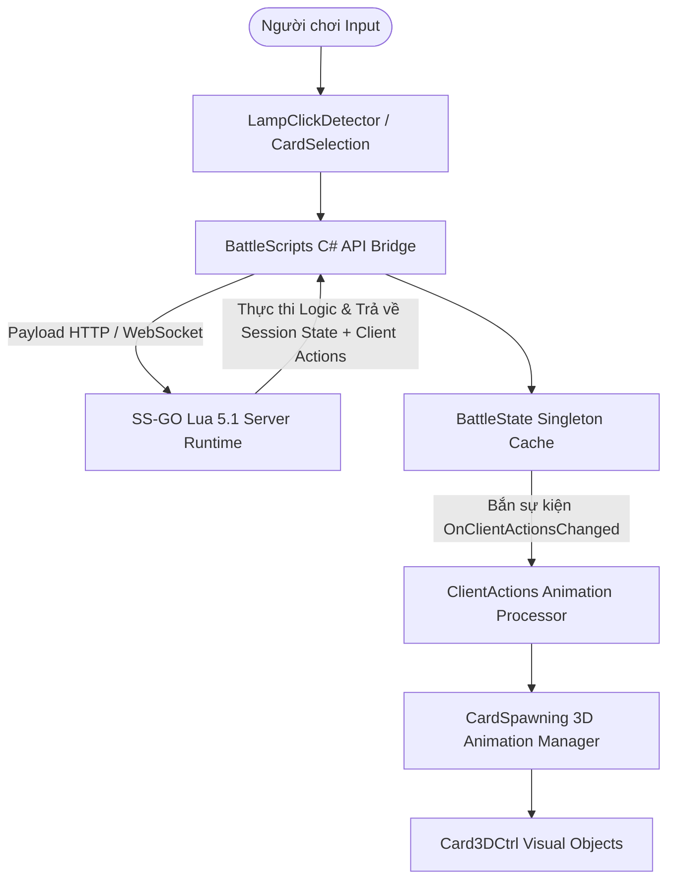

# 02. Kiến Trúc Mã Nguồn & Hệ Thống

## 1. Tổng Quan Kiến Trúc Cấp Cao

Dự án `_sg03` triển khai game thẻ bài chiến thuật theo lượt sử dụng mô hình Client-Server:
- **Client (Unity C#)**: Xử lý hiển thị 3D, tương tác người dùng, chọn mục tiêu bằng Raycast, animation thẻ bài, âm thanh, HUD và giao diện UI.
- **Server Runtime (SS-GO Lua 5.1)**: Thực thi logic game authoritative, lưu trữ trạng thái trận đấu, tính toán sát thương, kích hoạt kỹ năng, khởi tạo bài và quản lý chuyển lượt.



---

## 2. Các Subsystem Chính Phía Client C#

### 2.1. Quản Lý Trạng Thái & Đồng Bộ (`BattleState/`)

- **`BattleStateCtrl.cs`**: Điều phối chính kết nối giữa `BattleState`, `BattleScripts`, `CardSpawning`, `CardSelection`, `CardHoverDetector`, `CardHolderHoverDetector`, `BattleCardDefinitions`, và `ClientActions`.
- **`BattleState.cs`**: Cấu trúc dữ liệu cache trạng thái trung tâm. Nhận JSON từ `BattleScripts` và parse dữ liệu:
  - `AlphaHp` & `OmegaHp`, `AlphaMaxHp` & `OmegaMaxHp`
  - Các mảng khu vực: `AlphaHand`, `AlphaFrontLine`, `AlphaBackLine`, `AlphaTheSource`, `AlphaTheVoid`, và các mảng tương ứng phía `Omega`.
  - Trạng thái lượt: `Turn`, `Action`, `NextMove` (`NextMoveType`), `AlphaDefending`, `OmegaDefending`.
  - `ClientActions`: Mảng các lệnh chuỗi cho animation client.
  - **Sự Kiện C# (Events)**:
    - `OnBattleStatusChanged`: Kích hoạt khi nhận được trạng thái trận đấu mới từ server.
    - `OnClientActionsChanged`: Kích hoạt khi có chuỗi hành động client mới cần phát lại.
    - `OnGameStart`: Bắn ra khi thiết lập trận đấu ban đầu hoàn tất.
    - `OnNextMoveChanged`: Bắn ra khi có sự thay đổi giai đoạn/lượt chơi.

### 2.2. Bridge Kết Nối Mạng & Script (`BattleScripts.cs`)

`BattleScripts` đóng vai trò là cầu nối giao tiếp tới các endpoint API server Lua SS-GO:
- `RunInitCards`: Gọi `init_cards.lua` để chia bài ban đầu.
- `RunGetCardDefinitions`: Gọi `get_card_definitions.lua` để lấy chỉ số và metadata của các lá bài đang chơi.
- `RunAlphaCardDeploy`: Gọi `alpha_card_deploy.lua` để gửi vị trí bài thả ra sân.
- `RunAlphaCardActive`: Gọi `alpha_card_active.lua` để thực thi đòn tấn công và kích hoạt kỹ năng.
- `RunAlphaDefendingEnd`: Gọi `alpha_defending_end.lua` để xác nhận phân công phòng thủ.
- `RunAlphaTurnEnd`: Gọi `alpha_turn_end.lua` để kết thúc lượt hiện tại.

### 2.3. Tương Tác & Chọn Mục Tiêu (`CardSelection.cs`, `CardHoverDetector.cs`)

- **`CardSelection.cs`**: Quản lý việc chọn thẻ bài và slot mục tiêu bằng Raycast. Hỗ trợ hiển thị mũi tên chỉ định mục tiêu 3D (Arrow Indicator) từ bài tấn công/kỹ năng tới bài phòng thủ.
- **`CardHoverDetector.cs`**: Xử lý rê chuột (hover) trên thẻ bài 3D, làm nổi bật viền và hiển thị Tooltip 3D chứa chỉ số (ATK, DEF, HP, kỹ năng).

### 2.4. Xử Lý Animation Client Action (`ClientActions.cs`, `CardSpawning.cs`)

Client action trả về từ Lua server có dạng chuỗi định dạng (ví dụ `1:alpha_source_to_hand:UUID,slot`). `ClientActions` đọc chuỗi này và điều khiển `CardSpawning` phát animation lần lượt:
- `alpha_source_to_hand` / `omega_source_to_hand`: Animation rút bài lên tay.
- `alpha_hand_to_front_line` / `alpha_hand_to_back_line`: Animation thả bài ra sân.
- `alpha_card_take_damage` / `omega_card_take_damage`: Phát hiệu ứng mất máu/giáp và cập nhật số hiển thị.
- `alpha_card_ability`: Phát hiệu ứng kỹ năng và highlight bài nguồn/mục tiêu.
- `alpha_card_sent_to_void`: Đưa bài bị tiêu diệt hoặc tiêu thụ vào mộ `the_void`.

### 2.5. Vị Trí Bàn Đấu 3D (`Desk/DeskPositionCtrl.cs`)

`DeskPositionCtrl` định nghĩa các điểm mốc `Transform` 3D trong không gian bàn đấu:
- **Slot Alpha**: Hand (5 slot), Front Line (5 slot), Back Line (5 slot), Source, Void.
- **Slot Omega**: Hand (5 slot), Front Line (5 slot), Back Line (5 slot), Source, Void.
- **Slot Đèn Linh Hồn**: Alpha Lamp Position, Omega Lamp Position, Card Deploy Position.

### 2.6. Điều Kiện Đèn Linh Hồn (`LampOfSoul/`)

- **`LampOfSoulCtrl.cs`**: Quản lý di chuyển của vật thể Đèn Linh Hồn giữa phía Alpha, phía Omega và vị trí Deploy trung tâm.
- **`LampClickDetector.cs`**: Bắt sự kiện click Raycast vào mô hình Đèn Linh Hồn. Khi click vào đèn, nó hoạt động như nút "Xác Nhận Phase / Kết Thúc Lượt".

### 2.7. Thực Thể Thẻ Bài 3D (`Card/`)

- **`Card3DCtrl.cs`**: Controller chính gắn trên mỗi GameObject bài 3D. Chứa tham chiếu hiển thị chỉ số (`Card3DStats`), lật mặt bài (`CardFaceCtrl`), viền shader highlight (`CardOutlineIndicator`), và di chuyển (`CardHolderMovement`).
- **`BattleCardDefinitions.cs`**: Bộ nhớ cache phía client lưu dữ liệu `CardDefinitionData` trả về từ server.

---

## 3. Kiến Trúc Lua Phía Server (`Assets/SaiGame/LuaScript/Scripts/`)

### 3.1. Cấu Trúc Session State

Server duy trì đối tượng JSON session trận đấu gồm:

```json
{
  "session_id": "uuid",
  "turn": 1,
  "action": 0,
  "alpha_hp": 1000,
  "alpha_max_hp": 1000,
  "omega_hp": 1000,
  "omega_max_hp": 1000,
  "alpha_hand": [...],
  "alpha_front_line": [...],
  "alpha_back_line": [...],
  "alpha_the_source": [...],
  "alpha_the_void": [...],
  "omega_hand": [...],
  "omega_front_line": [...],
  "omega_back_line": [...],
  "omega_the_source": [...],
  "omega_the_void": [...],
  "metadata": {
    "next_move": "alpha_turn",
    "last_char_deploy_turn": 1
  },
  "client_actions": []
}
```

### 3.2. Pipeline Xử Lý Sự Kiện Kỹ Năng (`lib_ability_core.lua`)

1. **Trích Xuất**: `_get_ability_keys` đọc danh sách kỹ năng từ `card.metadata.abilities`.
2. **Xác Minh Vị Trí**: `can_ability_target_position` kiểm tra vị trí nhắm mục tiêu xem có hợp lệ không (`own_frontline`, `enemy_frontline`, v.v.).
3. **Điều Hướng**: `_dispatch_one_ability` chọn library theo `handler_group` của Ability: `lib_ability_human.lua`, `lib_ability_darkborn.lua`, `lib_ability_lightborn.lua` hoặc `lib_ability_natureborn.lua`.
4. **Ghi Log Hành Động**: Các Client Action sinh ra được đưa vào danh sách `client_actions` để gửi về client.
