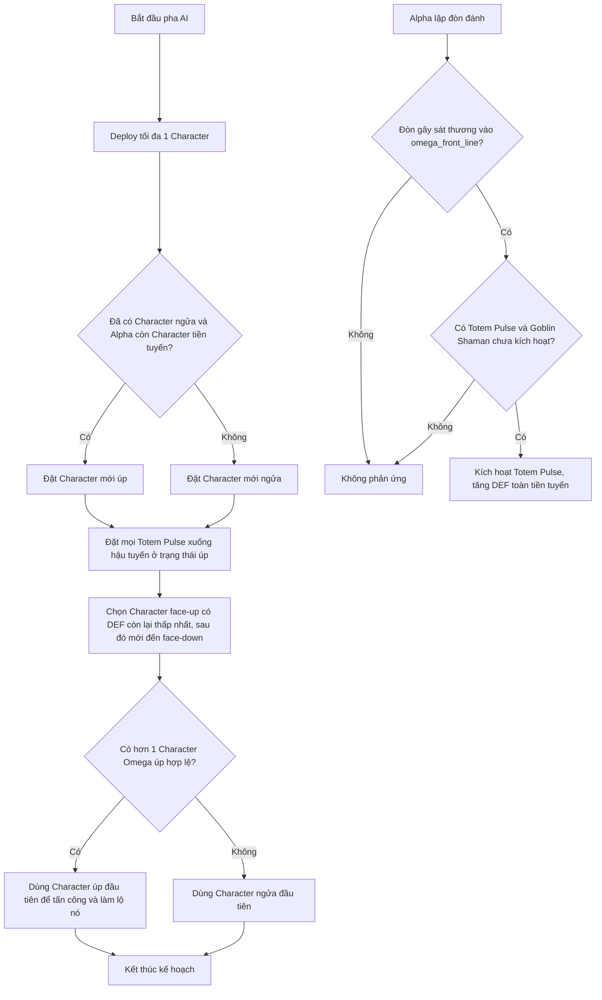

# Chiến thuật AI Goblin Shaman

> Phân loại: Normal Enemy
>
> Enemy key: `goblin_shaman`
>
> Script chính: `Assets/SaiGame/LuaScript/Scripts/enemy_ai_goblin_shaman.lua`

## Tổng quan

AI Goblin Shaman xây dựng một đội hình phòng thủ xoay quanh ba ý tưởng:

1. Mỗi lượt chỉ đưa một Character ra tiền tuyến.
2. Giữ lại đúng một Character úp để che giấu thông tin, nhưng lần lượt cho các Character úp dư thừa tấn công để lật chúng lên.
3. Đặt toàn bộ `Totem Pulse` xuống hậu tuyến và tự động dùng một Totem khi tiền tuyến Omega sắp nhận sát thương.

AI không chọn ngẫu nhiên trong ba pha này. Khi có nhiều lựa chọn ngang nhau, nó ưu tiên lá hoặc slot xuất hiện trước trong thứ tự mảng của battle state.

## 1. Triển khai đội hình (`deploy`)

### Tiền tuyến

- Lấy các lá Character trên tay theo thứ tự hiện có.
- Chỉ chọn Character đầu tiên và đặt vào slot trống đầu tiên của `omega_front_line`.
- Vì vậy, AI triển khai tối đa một Character mỗi lượt.
- Character mới được lật ngửa nếu Omega chưa có Character lật ngửa, hoặc nếu tiền tuyến Alpha không còn Character.
- Character mới được giữ úp khi Omega đã có ít nhất một Character lật ngửa và Alpha vẫn còn Character ở tiền tuyến.

Quy tắc này khiến Omega thường duy trì một lực lượng công khai để hành động, đồng thời giữ quân tiếp viện mới ở trạng thái ẩn khi trận chiến tiền tuyến vẫn tiếp diễn.

### Hậu tuyến

- Lọc riêng tất cả lá `totem_pulse` trên tay.
- Đặt lần lượt mọi `Totem Pulse` vào các slot trống của `omega_back_line` cho đến khi hết Totem hoặc hết chỗ.
- Mọi `Totem Pulse` mới triển khai đều úp (`face_up = false`, `expose = false`).
- Các Ability khác không được hàm `deploy` của Goblin Shaman đưa xuống bàn.

Sau khi triển khai, các lá đã đặt được xóa khỏi tay; `final_def` được đưa về DEF cơ bản và `total_damage_received` được đưa về 0 theo cơ chế dùng chung.

## 2. Phản ứng phòng thủ (`defend`)

AI chỉ cân nhắc dùng `Totem Pulse` khi đồng thời thỏa mãn tất cả điều kiện sau:

1. Tồn tại `pending_attack`.
2. `pending_attack.damage_dealt > 0`.
3. Mục tiêu của đòn đánh hiện nằm trong `omega_front_line`.
4. Hậu tuyến Omega có ít nhất một lá `totem_pulse`.
5. Tiền tuyến Omega có ít nhất một `goblin_shaman` chưa kích hoạt (`trigger ~= true`).

Nếu thiếu bất kỳ điều kiện nào, AI bỏ qua phản ứng và không tiêu thụ Totem.

Khi có thể kích hoạt, AI chọn `Totem Pulse` theo thứ tự:

1. Lá đã lộ đầu tiên ở hậu tuyến.
2. Nếu không có lá đã lộ, lá úp đầu tiên.

`Totem Pulse` sau đó:

- tự lật ngửa; Goblin Shaman được chọn cũng lật ngửa và bị đánh dấu đã kích hoạt;
- cộng `def_add` của Totem vào `final_def` của mọi lá thật đang nằm trên `omega_front_line`;
- rời hậu tuyến và được đưa vào `omega_the_void`.

Phản ứng xảy ra sau khi Alpha đã lập `pending_attack` nhưng trước khi đòn đánh được giải quyết. Vì vậy, Totem không giảm trực tiếp `damage_dealt`; nó nâng ngưỡng phòng thủ `final_def` trước lúc hệ thống cộng sát thương và kiểm tra lá bị hạ.

## 3. Lập kế hoạch tấn công (`plan_attack`)

Mỗi lần lập kế hoạch, AI tạo tối đa một hành động tấn công.

### Chọn mục tiêu

Thứ tự ưu tiên của mục tiêu là:

1. Character face-up (`face_up = true`) ở `alpha_front_line` có hiệu `final_def - total_damage_received` thấp nhất.
2. Nếu không có Character face-up, chọn Character face-down đầu tiên theo thứ tự slot.
3. Nếu tiền tuyến Alpha trống, chọn lá thật đầu tiên ở `alpha_back_line`.
4. Nếu cả hai hàng không có mục tiêu, tấn công trực tiếp `alpha_hp`.

Khi nhiều mục tiêu face-up có cùng hiệu số, AI chọn mục tiêu ở slot xuất hiện trước. Điều này làm cho cách chọn mục tiêu hoàn toàn xác định.

### Chọn quân tấn công

AI đếm các Character Omega đang úp, chưa kích hoạt và nằm ở tiền tuyến:

- Nếu có từ hai lá úp trở lên, AI chọn lá úp hợp lệ đầu tiên để tấn công. Hành động tấn công sẽ làm lộ lá đó, nhờ vậy chỉ còn lại một Character được che giấu.
- Nếu có không quá một lá úp, AI chọn Character lật ngửa, chưa kích hoạt đầu tiên.
- Nếu không có quân tấn công hợp lệ, AI kết thúc lượt Omega ngay.

Kết hợp với quy tắc triển khai, hành vi này tạo thành chiến thuật "giữ một quân ẩn": AI không dùng Character úp cuối cùng khi vẫn còn một Character lật ngửa có thể hành động, nhưng sẽ dùng các lá úp dư thừa để tránh tích tụ quá nhiều quân không hoạt động.

## Cây quyết định rút gọn



## Điểm mạnh

- Duy trì thông tin ẩn thay vì lật toàn bộ đội hình ngay khi triển khai.
- Tự động bảo vệ toàn tiền tuyến đúng thời điểm có một đòn sát thương sắp được giải quyết.
- Tập trung tấn công Character face-up có `final_def - total_damage_received` thấp, tạo khả năng kết liễu mục tiêu yếu.
- Quy tắc xác định giúp hành vi ổn định và dễ tái hiện khi kiểm thử.

## Điểm yếu và cách đối phó

- `Totem Pulse` chỉ kích hoạt khi đòn đánh nhắm vào tiền tuyến và có `damage_dealt > 0`; các hành động không tạo pending damage hoặc không nhắm tiền tuyến không kích hoạt phản ứng này.
- Mỗi Totem cần một Goblin Shaman chưa kích hoạt. Ép Shaman dùng lượt hoặc loại Shaman khỏi tiền tuyến sẽ khóa phản ứng Totem còn lại trong lượt đó.
- AI ưu tiên mục tiêu face-up có DEF còn lại thấp nhất, nên người chơi có thể dự đoán mục tiêu và sắp xếp phòng thủ quanh lá đó.
- AI chỉ triển khai `Totem Pulse` trong nhóm Ability. `Brute Call` và các Ability khác không được ba handler `deploy`, `defend`, `plan_attack` của AI này chủ động sử dụng.
- Việc luôn ưu tiên slot đầu tiên khi hòa khiến hướng tấn công và thứ tự lật quân có thể bị khai thác sau khi người chơi nhận ra quy luật.

## Tóm tắt thuật toán

```text
DEPLOY
  đặt Character đầu tiên vào slot tiền tuyến trống đầu tiên
  nếu đã có Character ngửa và Alpha còn Character tiền tuyến: giữ lá mới úp
  ngược lại: lật lá mới
  đặt mọi Totem Pulse vào các slot hậu tuyến trống, luôn úp

DEFEND
  nếu pending damage > 0 nhắm vào tiền tuyến Omega
     và có Totem Pulse ở hậu tuyến
     và có Goblin Shaman chưa kích hoạt ở tiền tuyến:
       kích hoạt một Totem Pulse và tăng DEF toàn tiền tuyến

ATTACK
  ưu tiên Character Alpha face-up có (final_def - total_damage_received) thấp nhất
  nếu không có Character face-up: chọn Character face-down đầu tiên theo thứ tự slot
  nếu có hơn một Character Omega úp: tấn công bằng lá úp đầu tiên
  nếu không: tấn công bằng Character ngửa đầu tiên
  nếu không có quân hợp lệ: kết thúc lượt
```
