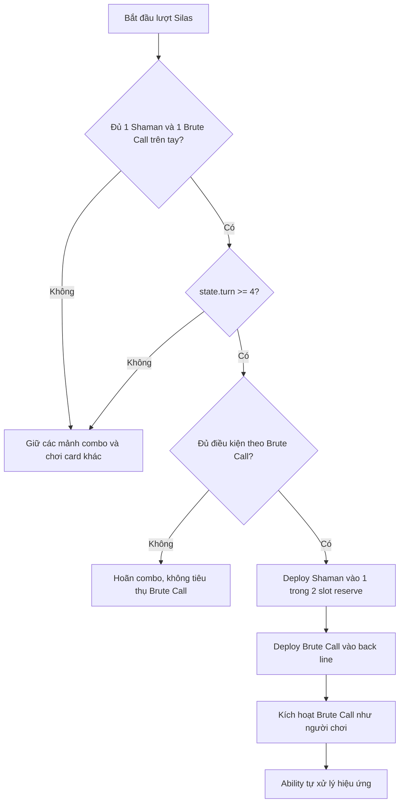

# Chiến thuật AI Silas

> Trạng thái: Đã triển khai AI
>
> Phân loại tài liệu: Normal Enemy
>
> Entity type trong cấu hình: NPC
>
> Enemy key: `silas`
>
> Battle AI dự kiến: `Assets/SaiGame/LuaScript/Scripts/enemy_ai_silas.lua`

## Tổng quan

Silas giữ bộ combo gồm **một `Goblin Shaman` và một `Brute Call` trên tay**, chờ đến lượt Omega hợp lệ từ turn 4 trở đi mới triển khai combo theo [Brute Call](../../cards/natureborn/goblin/abilities/brute_call.md).

Việc triệu hồi bắt buộc đi qua Ability `brute_call` hiện có. AI chỉ chọn đúng source Ability và Goblin Shaman target, rồi gọi Ability pipeline; toàn bộ hiệu ứng triệu hồi do Ability xử lý.

## Cấu hình entity

Theo cấu hình được cung cấp:

| Thuộc tính | Giá trị |
| --- | --- |
| Name | Silas |
| Rarity | Common |
| Type | NPC |
| Documentation category | Normal Enemy |
| `choose_card_1` | `goblin_shaman` |
| `choose_card_2` | `brute_call` |
| `choose_card_3` | `goblin_saboteur` |

Danh sách card của Silas:

| Card code | Card count | Vai trò |
| --- | ---: | --- |
| `goblin_shaman` | 3 | Character bắt buộc cho combo |
| `goblin_saboteur` | 3 | Character chiến đấu |
| `skeleton` | 3 | Character chiến đấu |
| `goblin_grunt` | 3 | Character chiến đấu |
| `totem_pulse` | 3 | Ability hỗ trợ Goblin Shaman |
| `brute_call` | 3 | Ability triệu hồi Goblin Brute |
| `goblin_brute` | 3 | Character 4 sao |
| `zombie_male` | 3 | Character chiến đấu |
| `zombie_female` | 3 | Character chiến đấu |
| **Tổng số card** | **27** | 9 loại card, mỗi loại 3 bản |

## Quy tắc rút bài và opening hand

Hệ thống hiện có hai khái niệm khác nhau:

- `lib_battle_common.get_draw_card_count()` trả về **2**, nghĩa là số card rút thông thường mỗi lần draw là hai.
- `init_cards.lua` hiện tạo opening hand Omega bằng ba card preset, sau đó rút thêm hai card ngẫu nhiên. Opening hand tối đa là năm card, không phải hai.

Với metadata hiện tại, ba card được bảo đảm trong opening hand là:

1. `goblin_shaman`
2. `brute_call`
3. `goblin_saboteur`

Hai card ngẫu nhiên còn lại không ảnh hưởng đến điều kiện có đủ bộ combo cơ bản.

## Bộ combo phải giữ trên tay

AI phải nhận diện và reserve đúng hai card:

- một `goblin_shaman`;
- một `brute_call`.

Trước lượt combo:

- không deploy Goblin Shaman đã reserve;
- không deploy hoặc tiêu thụ Brute Call đã reserve;
- không dùng các card reserve làm attacker, Ability source hoặc mục đích khác;
- luôn giữ ít nhất hai slot trống liền kề trên `omega_front_line` cho combo Brute;
- các card không thuộc bộ reserve vẫn có thể được triển khai bằng chiến thuật thông thường.

Nếu trên tay chưa đủ một `goblin_shaman` và một `brute_call`, AI tiếp tục giữ những thành phần đã có và chờ lượt sau. AI không được tạo card giả, sao chép card hoặc lấy card trực tiếp từ source để hoàn thiện combo.

## Điều kiện kích hoạt combo

Combo chỉ được thực hiện khi đồng thời thỏa mãn:

1. Đang là lượt hành động của Omega/Silas.
2. Turn hiện tại từ 4 trở đi.
3. Trên tay có đủ một `goblin_shaman` và một `brute_call` đã reserve.
4. `omega_front_line` có ít nhất hai slot trống liền kề đã được reserve: một cho Goblin Shaman được chọn và một cho Goblin Brute.
5. `omega_back_line` có vị trí cho Brute Call.
6. Mọi điều kiện kích hoạt của [Brute Call](../../cards/natureborn/goblin/abilities/brute_call.md) đều được thỏa mãn.

Nếu chưa đủ điều kiện, AI hoãn combo.

## Luồng triển khai combo

### Bước 1: triển khai Goblin Shaman được chọn

- Đưa một `goblin_shaman` đã reserve từ `omega_hand` vào một trong hai slot trống liền kề đã giữ.
- Giữ slot trống liền kề còn lại cho Goblin Brute.
- Ghi client actions bằng cơ chế deploy dùng chung.
- Không đặt Goblin Brute trực tiếp lên bàn trong bước này.

### Bước 2: triển khai Brute Call

- Đưa `brute_call` đã reserve từ `omega_hand` vào một slot trống của `omega_back_line`.
- Brute Call phải nằm ở `omega_back_line`; AI Silas không đặt Ability này ở front-line.

### Bước 3: kích hoạt Brute Call

AI kích hoạt `Brute Call` lên Goblin Shaman đã triển khai bằng đúng luồng kích hoạt Ability tiêu chuẩn mà người chơi sử dụng.

Chi tiết điều kiện, mục tiêu, hiệu ứng, tiêu thụ Ability và kết quả triệu hồi được định nghĩa duy nhất trong [Brute Call](../../cards/natureborn/goblin/abilities/brute_call.md).

AI không được thêm bất kỳ hiệu ứng hoặc thao tác triệu hồi riêng nào sau khi kích hoạt; kết quả hoàn toàn do Ability tiêu chuẩn xử lý.

## Deploy ngoài combo

Trước khi combo được thực hiện:

- bỏ qua hai card đang reserve khi quét `omega_hand`;
- có thể deploy các Character khác vào tiền tuyến;
- ngay khi rút được `Totem Pulse`, ưu tiên triển khai Ability này vào back-line có slot trống;
- khi một Character của Omega đang bị tấn công, ưu tiên kích hoạt `Totem Pulse` ngay khi có thể;
- luôn giữ ít nhất hai slot trống liền kề trên `omega_front_line`; vì hàng có năm slot, chỉ được phép để tối đa ba slot có card trước khi combo hoàn tất;
- hai slot reserve được dành lần lượt cho Shaman được chọn và Goblin Brute, để combo có thể chạy ngay từ turn hợp lệ;
- không được để deploy thông thường tiêu thụ hoặc ghi đè các card reserve.

Sau khi combo hoàn tất, Silas có thể quay về quy tắc deploy và plan attack dùng chung.

## Phản ứng phòng thủ (`defend`)

Chưa có phản ứng phòng thủ riêng được yêu cầu cho Silas. Baseline:

```text
defend(state)
  -> nil
```

## Lập kế hoạch tấn công (`plan_attack`)

Ngoài lượt thực hiện combo, baseline:

- chọn Character Omega chưa kích hoạt đầu tiên, loại trừ các card đang reserve trong hand;
- ưu tiên Character Alpha đang face-up có `final_def` thấp nhất ở tiền tuyến; nếu không có Character face-up, chọn Character tiền tuyến có `final_def` thấp nhất;
- nếu Alpha không còn Character tiền tuyến, lập kế hoạch đánh `alpha_hp`;
- không có attacker hợp lệ thì kết thúc lượt Omega.

## Cây quyết định



## Blocker cần xử lý trước khi code AI

### 1. Chuẩn bị battle state cho Brute Call

Battle state của Omega phải được chuẩn bị để thỏa toàn bộ điều kiện của [Brute Call](../../cards/natureborn/goblin/abilities/brute_call.md) trước lượt combo. AI Silas không được tự thêm logic thay thế các điều kiện này.

## Tích hợp bắt buộc

- Tạo library `enemy_ai_silas.lua` với `deploy`, `defend`, `plan_attack`.
- Thêm nhánh `silas` vào `lib_battle_entity_ai.lua`.
- Load `enemy_ai_silas` trong các regular battle script đi qua dispatcher.
- Bảo đảm battle state thỏa điều kiện của [Brute Call](../../cards/natureborn/goblin/abilities/brute_call.md).
- Kích hoạt Brute Call qua cùng luồng Ability chuẩn như người chơi; không nhân bản thuật toán Ability trong AI.

## Kịch bản kiểm thử tối thiểu

1. Mỗi card trong danh sách entity tạo đúng ba bản trên `omega_the_source` và `omega_the_void`; riêng một `goblin_brute` được chuẩn bị trong `omega_the_void`, còn hai bản ở `omega_the_source`.
2. Mỗi draw thông thường lấy tối đa hai card.
3. Opening hand lấy ba card preset và hai card ngẫu nhiên theo code hiện tại.
4. Trước turn 4, Goblin Shaman và Brute Call đã reserve không bị deploy.
5. Thiếu Goblin Shaman hoặc Brute Call thì AI chờ, không tự lấy card từ source.
6. Chưa đủ điều kiện theo [Brute Call](../../cards/natureborn/goblin/abilities/brute_call.md) thì AI hoãn combo.
7. Trước combo, AI duy trì hai slot trống liền kề ở tiền tuyến.
8. Từ `state.turn >= 4`, khi đủ card và slot, AI deploy một Shaman vào slot reserve rồi đặt Brute Call.
9. Brute Call được kích hoạt qua cùng luồng Ability chuẩn như người chơi.
10. Kết quả combo tuân theo [Brute Call](../../cards/natureborn/goblin/abilities/brute_call.md), không có thao tác triệu hồi riêng trong AI.

## Điều kiện hoàn thành

Silas chỉ được chuyển sang trạng thái **Đã triển khai** khi:

- battle state đáp ứng điều kiện của Brute Call;
- reserve logic giữ đúng một Shaman và một Brute Call;
- combo chỉ chạy ở lượt hợp lệ từ turn 4;
- việc triệu hồi hoàn toàn đi qua Ability `brute_call` hiện có;
- dispatcher, runtime libraries và toàn bộ test combo đã hoàn tất.
