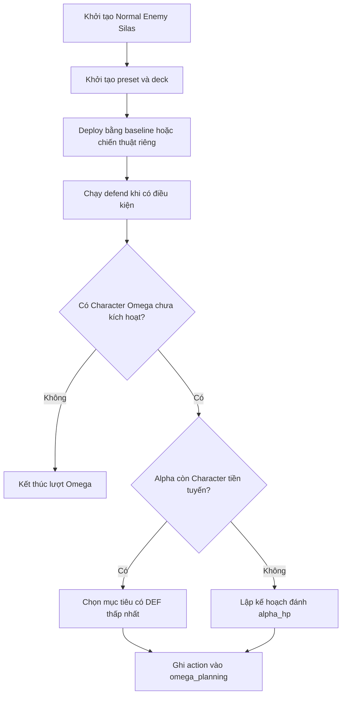

# Đặc tả AI Silas

> Trạng thái: Chuẩn bị triển khai
>
> Phân loại: Normal Enemy
>
> Enemy key: `silas`
>
> Battle AI dự kiến: `Assets/SaiGame/LuaScript/Scripts/enemy_ai_silas.lua`

## Tổng quan

Tài liệu này là khung thiết kế và checklist tích hợp cho Normal Enemy mới **Silas**.

Repo hiện cho phép chọn `silas` trong trường Enemy của UI và đang dùng giá trị này làm mặc định. Tuy nhiên, repo chưa có card data, preset, Ability hoặc script AI riêng cho Silas.

Các hành vi trong phần **Đề xuất baseline** chỉ là phương án khởi đầu để enemy có thể tham gia battle flow. Chúng không được xem là hành vi đã triển khai.

## Trạng thái hiện tại

| Hạng mục | Trạng thái | Ghi chú |
| --- | --- | --- |
| Enemy key `silas` | Đã có một phần | Đang xuất hiện trong UI chọn Enemy |
| Phân loại Normal Enemy | Đã xác nhận | Đặt tài liệu trong danh sách Normal Enemies |
| Card data Silas | Chưa tìm thấy | Chưa có asset Character hoặc Ability |
| Battle deck/preset | Chưa có | Chưa có bộ bài PvE gắn với Silas |
| `enemy_ai_silas.lua` | Chưa có | Chưa có ba handler AI |
| Battle dispatcher | Chưa tích hợp | Hiện chỉ dispatch cho `goblin_shaman` |
| Chiến thuật chính thức | TBD | Chưa có Ability, ưu tiên hoặc phase được duyệt |

## Khung chiến thuật chính thức cần chốt

Trước khi triển khai, cần xác định vai trò chiến đấu chính thức của Silas:

| Nhóm quyết định | Thiết kế đã duyệt |
| --- | --- |
| Vai trò chiến đấu | TBD |
| Faction/chủng tộc | TBD |
| Character chủ lực | TBD |
| Ability đặc trưng | TBD |
| Quy tắc deploy | TBD |
| Phản ứng defend | TBD |
| Thứ tự chọn attacker | TBD |
| Thứ tự chọn defender | TBD |
| Điều kiện đánh trực tiếp HP | TBD |
| Cơ chế theo phase hoặc HP | TBD |
| Điểm mạnh | TBD |
| Điểm yếu/cách đối phó | TBD |

Không tự suy đoán card, chỉ số hoặc Ability của Silas trước khi thiết kế gameplay được duyệt.

## Đề xuất baseline

Baseline dưới đây giúp Silas kết nối battle flow trước khi chiến thuật riêng được duyệt. Đây là đề xuất, không phải hành vi đã triển khai.

### 1. Triển khai đội hình (`deploy`)

Đề xuất baseline:

- Dùng cơ chế deploy Omega dùng chung.
- Character trong deck Silas được đưa vào `omega_front_line`.
- Ability và các loại bài khác được đưa vào `omega_back_line`.
- Các lá mới triển khai bắt đầu ở trạng thái úp.
- Không ưu tiên card code cụ thể.
- Lá không thể triển khai vì hết slot tiếp tục nằm trên tay.

Chữ ký handler:

```text
deploy(state)
  -> omega_front_line, omega_back_line, omega_hand, err
```

Các quyết định chiến thuật cần chốt:

- Số Character tối đa Silas triển khai mỗi lượt.
- Thứ tự ưu tiên Character và Ability.
- Điều kiện lật ngửa hoặc giữ úp bài.
- Ảnh hưởng của lượt, HP và đội hình Alpha lên deploy.

### 2. Phản ứng phòng thủ (`defend`)

Đề xuất baseline: Silas không có phản ứng phòng thủ riêng và handler trả về `nil`.

```text
defend(state)
  -> err
```

Nếu Silas có Ability phòng thủ, thiết kế phải xác định:

1. Sự kiện và điều kiện kích hoạt.
2. Ability nguồn nằm ở vùng bài nào.
3. Cách chọn Ability và mục tiêu.
4. Luật phá hòa khi có nhiều lựa chọn.
5. Card hoặc tài nguyên bị tiêu thụ.
6. Thay đổi lên `pending_attack`, `final_def`, HP hoặc battle state.

Không sao chép `Totem Pulse` từ Goblin Shaman nếu deck Silas không có Ability tương ứng.

### 3. Lập kế hoạch tấn công (`plan_attack`)

Đề xuất baseline:

- Dùng luật lập kế hoạch Omega dùng chung.
- Chọn Character Omega chưa kích hoạt đầu tiên.
- Ưu tiên mục tiêu tiền tuyến Alpha có `final_def` thấp nhất.
- Khi tiền tuyến Alpha không còn Character, lập kế hoạch đánh trực tiếp `alpha_hp`.
- Không có attacker hợp lệ thì kết thúc lượt Omega.

```text
plan_attack(state)
  -> err
```

Các quyết định tạo bản sắc cho Silas:

- Silas ưu tiên mục tiêu yếu, mạnh, đã lộ hay đang úp.
- Silas có bảo tồn thông tin của card úp không.
- Silas có thay đổi chiến thuật theo HP hoặc số lượt không.
- Silas tạo một hay nhiều hành động trong `state.omega_planning`.

## Cây quyết định baseline



## Tích hợp battle bắt buộc

### Dispatcher

`lib_battle_entity_ai.lua` cần nhận `state.metadata.enemy_entity_key == "silas"` và dispatch:

- `enemy_ai_silas.deploy(state)`
- `enemy_ai_silas.defend(state)`
- `enemy_ai_silas.plan_attack(state)`

Không được fallback sang chiến thuật Goblin Shaman.

### Runtime libraries

Kiểm tra các regular script đi qua dispatcher và thêm directive đầu file khi cần:

- `init_cards.lua`
- `alpha_card_active.lua`
- `alpha_turn_end.lua`
- `alpha_defending_end.lua`

```lua
require "enemy_ai_silas"
```

Theo contract ss-go, không dùng `require(...)` và không đặt directive `require` trong library script.

### Dữ liệu trận đấu

Cần chuẩn bị:

- Entity/preset dùng enemy key `silas`.
- Deck/preset Omega thuộc về Silas.
- Card definition cho từng Character và Ability trong deck.
- `item_defs` đầy đủ metadata type và base stats mà AI sử dụng.
- Script definition `enemy_ai_silas` được đăng ký là library.

## Kịch bản kiểm thử tối thiểu

1. Chọn `silas` trong UI và khởi tạo đúng Normal Enemy.
2. Dispatcher gọi handler Silas, không gọi Goblin Shaman.
3. Deck/preset và toàn bộ card definition của Silas được tải đầy đủ.
4. Deploy xử lý đúng tay trống, hàng trống và hàng đầy.
5. Baseline `defend` không thay đổi state.
6. `plan_attack` chọn attacker và defender theo quy tắc xác định.
7. Không có attacker thì Omega kết thúc lượt.
8. Client actions không làm lộ card đang úp.
9. Mọi lỗi từ Ability hoặc helper được truyền ra.

## Điều kiện hoàn thành

Tài liệu chỉ chuyển sang trạng thái **Đã triển khai** khi:

- vai trò chiến đấu và chiến thuật Silas đã được duyệt;
- card data, deck/preset và Ability cần thiết đã tồn tại;
- AI, dispatcher, runtime libraries và test đã hoàn tất;
- tài liệu mô tả hành vi thực tế thay vì baseline đề xuất.
