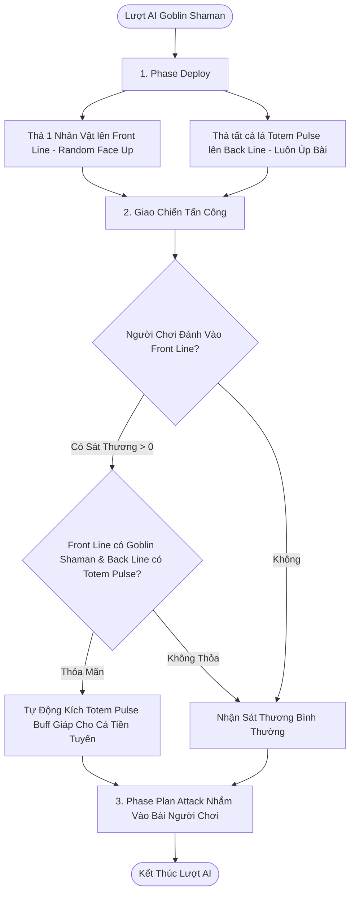

# Quái Thường: Goblin Shaman (`enemy_ai_goblin_shaman.lua`)

> [!IMPORTANT]
> **Phân Loại Quái**: **Quái Thường (Normal Monster)**  
> **Tệp Script AI**: `Assets/SaiGame/LuaScript/Scripts/enemy_ai_goblin_shaman.lua`

---

## 1. Tổng Quan Về Quái Thường Goblin Shaman

**Goblin Shaman** là một đơn vị **Quái Thường (Normal Monster)** thuộc tộc nhánh Goblin của **Natureborn** trong chế độ PvE. Mặc dù là quái thường, Goblin Shaman sở hữu chiến thuật cắm Totem phòng thủ và hỗ trợ đồng đội rất khó chịu nếu người chơi không tập trung dồn sát thương tiêu diệt sớm.

---

## 2. Phân Tích Chiến Thuật AI Chi Tiết Từ Mã Nguồn

Dựa trên việc xem xét kỹ mã nguồn `enemy_ai_goblin_shaman.lua`, chiến thuật thi đấu của Goblin Shaman được chia thành 3 pha hành động tự động:

### 🛡️ Chiến Thuật 1: Thả Bài (Deploy Strategy - Hàm `deploy`)
1. **Tiền Tuyến (Front Line)**:
   - Quét các lá bài Nhân vật (Character) trên tay.
   - Thả tối đa **1 thẻ Nhân vật** vào slot trống trên `omega_front_line`.
   - Quyết định lật mặt bài (`face_up`) ngẫu nhiên với tỉ lệ $50/50$.
2. **Hậu Thuẫn (Back Line)**:
   - Tìm tất cả các lá bài kỹ năng **Totem Pulse** (`totem_pulse`) trên tay.
   - Thả **tất cả** các lá Totem Pulse vào slot trống ở hàng `omega_back_line`.
   - **Đặc biệt**: Luôn đặt lá Totem Pulse ở trạng thái **Úp Mặt (`face_up = false`)** để giấu thông tin bài, tạo bất ngờ cho người chơi.

---

### 🛡️ Chiến Thuật 2: Phản Ứng Phòng Thủ (Defend Reaction - Hàm `defend`)
Khi người chơi (Phe Alpha) phát đòn tấn công vào tiền tuyến của Goblin Shaman:
1. **Kiểm Tra Sát Thương**: AI gọi `goblin_shaman_is_omega_front_line_taking_damage` để kiểm tra xem đòn tấn công sắp tới có thực sự gây sát thương ($> 0$) lên một thẻ bài ở `omega_front_line` hay không.
2. **Kiểm Tra Điều Kiện Nòng Cốt**:
   - Quét hàng `omega_front_line` xem còn thẻ nhân vật **Goblin Shaman** nào sống và chưa bị kích hoạt (`trigger ~= true`) hay không.
   - Quét hàng `omega_back_line` tìm lá bài **Totem Pulse** đang nằm chờ.
3. **Kích Hoạt Phòng Thủ Tự Động**:
   - Nếu đủ 2 điều kiện trên, AI tự động kích hoạt kỹ năng `totem_pulse` ngay lập tức tại sự kiện `on_defend`.
   - **Hiệu Ứng**: Cộng trực tiếp chỉ số giáp `def_add` cho **TOÀN BỘ** các đơn vị nhân vật trên sới tiền tuyến `omega_front_line` **trước khi đòn đánh của người chơi chạm vào**, giúp giảm thiểu sát thương nhận phải. Tiêu thụ lá Totem vào mộ `the_void`.

---

### ⚔️ Chiến Thuật 3: Lập Kế Hoạch Tấn Công (Attack Planning - Hàm `plan_attack`)
1. Gọi hàm tiện ích `omega_planning_to_attack` từ `lib_battle_ai.lua`.
2. Quét hàng tiền tuyến người chơi `alpha_front_line`, chọn ra các mục tiêu yếu nhất hoặc bài đã lật ngửa để phân công các đơn vị tiền tuyến Omega tấn công vào lượt tiếp theo.

---

## 3. Sơ Đồ Cây Quyết Định AI

