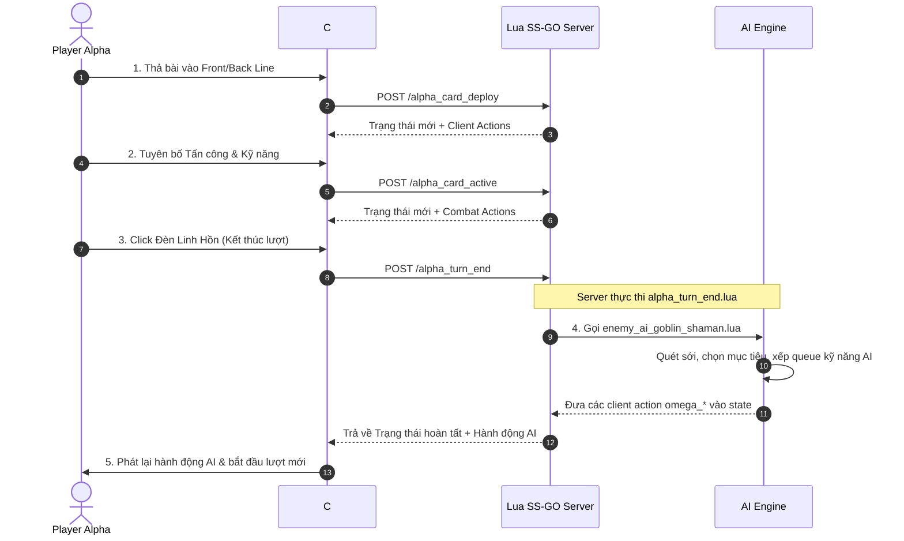

# Tổng Quan & Cơ Chế Chế Độ PvE

> [!NOTE]
> **Phạm vi**: Tài liệu này bao gồm các cơ chế, luồng kịch bản và tích hợp AI **dành riêng cho chế độ PvE (Player vs. Environment)**. Đối với luật chơi cốt lõi dùng chung, xem [Luật Chơi & Cơ Chế Trận Đấu](../01_game_rules.md).

---

## 1. Tổng Quan

Trong **Chế độ PvE**, người chơi (**Phe Alpha**) thi đấu đối đầu với Quái/Boss AI được điều khiển bởi server (**Phe Omega**).

### Các Đặc Điểm Chính Của PvE
- **Trải Nghiệm Singleplayer**: Không cần chờ đợi đối thủ qua mạng.
- **Tự Động Hóa AI Phía Server**: Việc ra bài, thả bài, tấn công và kích kỹ năng phía Omega được điều khiển hoàn toàn bằng script Lua phía server (`enemy_ai_goblin_shaman.lua`).
- **Kịch Bản Presets**: Trận đấu được khởi tạo sử dụng cấu hình bài preset cố định hoặc trọng số được định nghĩa trong metadata (`alpha_preset_metadata` và `omega_preset_metadata`).

---

## 2. Phân Loại Quái PvE

Tài liệu thiết kế thuật toán AI cho quái PvE được phân chia theo 3 cấp độ trong các thư mục:
- **[Quái Thường (`normal_monsters/`)](normal_monsters/_normal_monsters.md)** — Các đơn vị lính/quái thường (xem [Danh sách Quái Thường](normal_monsters/_normal_monsters.md)).
- **[Quái Tinh Anh (`elite_monsters/`)](elite_monsters/_elite_monsters.md)** — Các đơn vị quái tinh anh sở hữu bộ kỹ năng đặc biệt (xem [Danh sách Quái Tinh Anh](elite_monsters/_elite_monsters.md)).
- **[Boss (`boss_monsters/`)](boss_monsters/_boss_monsters.md)** — Trùm cuối màn chơi với các cơ chế chiến đấu đa giai đoạn (xem [Danh sách Boss](boss_monsters/_boss_monsters.md)).

---

## 3. Luồng Thực Thi Lượt Chơi PvE

---

## 4. Tài Liệu PvE Liên Quan

- [Thuật Toán AI Goblin Shaman (Quái Thường)](normal_monsters/goblin_shaman.md) — Phân tích kỹ thuật cây quyết định AI Goblin Shaman và thuật toán quét dòng.
- [Cấu Hình Kịch Bản Mẫu PvE](pve_preset_scenarios.md) — Hướng dẫn cấu hình bộ bài preset và metadata kịch bản cho Alpha và Omega.
