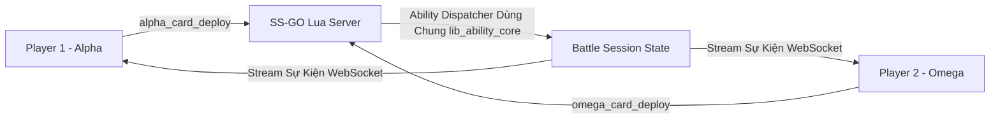

# Lộ Trình Kiến Trúc Chế Độ PvP

> [!NOTE]
> **Phạm vi**: Lộ trình thiết kế mở rộng core engine dùng chung của `_sg03` thành hệ thống thi đấu nhiều người chơi **PvP (Player vs. Player 1v1)** theo thời gian thực.

---

## 1. Chiến Lược Kiến Trúc

C# Client và Lua Ability Engine (`lib_ability_core.lua`) của `_sg03` được thiết kế ngay từ đầu theo hướng **Mode-Agnostic** (Không phụ thuộc chế độ). Việc chuyển đổi từ PvE sang PvP đòi hỏi rất ít thay đổi ở các cơ chế combat dùng chung.

### Các Yêu Cầu Chính Cho PvP
1. **Script Handler Đối Xứng**: Tạo các endpoint script API phía `omega_*` tương xứng với các script phía `alpha_*` (`omega_card_deploy.lua`, `omega_card_active.lua`, `omega_defending_end.lua`, `omega_turn_end.lua`).
2. **Trạng Thái Chuyển Lượt**: `metadata.next_move` luân phiên giữa `"alpha_turn"` và `"omega_turn"`.
3. **Bộ Đếm Thời Gian Lượt**: Áp dụng đếm ngược thời gian lượt theo thời gian thực (ví dụ 60 giây mỗi lượt).
4. **WebSocket / Push Notification Stream**: Thay thế cơ chế polling bằng thông báo server push để báo cho Player 2 ngay khi Player 1 thực thi hành động.
5. **Che Chắn Bài Chưa Lật**: Áp dụng `lib_battle_common.hide_unrevealed_omega_cards` để che các lá bài chưa ngửa trên tay/sân đối thủ đối với client của người chơi còn lại.

---

## 2. Kiến Trúc Handler Đối Xứng

---

## 3. Các Giai Đoạn Triển Khai

| Giai Đoạn | Mục Tiêu | Dữ Liệu Bàn Giao |
|---|---|---|
| **Giai đoạn 1** | Script Đối Xứng | Triển khai `omega_card_deploy.lua`, `omega_card_active.lua`, `omega_defending_end.lua`. |
| **Giai đoạn 2** | Ghép Trận & Session | Service Matchmaker ghép cặp 2 Player ID vào chung một `session_id`. |
| **Giai đoạn 3** | Đếm Giờ & Auto-End | Timer phía server tự động submit hành động rỗng nếu người chơi hết giờ. |
| **Giai đoạn 4** | WebSocket Gateway | Cập nhật realtime cho sự kiện `OnClientActionsChanged`. |
